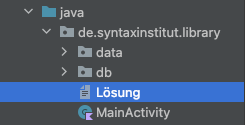
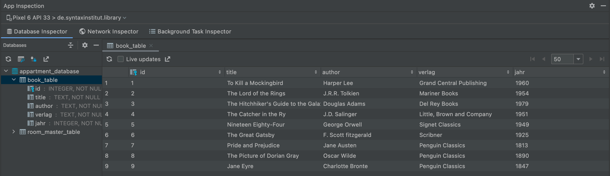
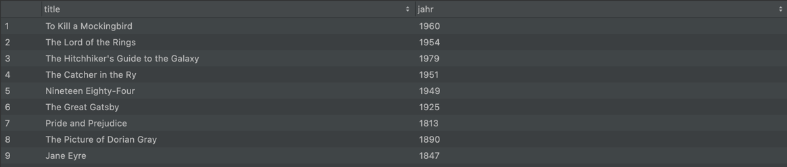

# Aufgaben
## 5.1 SQL Basics

Hiweis: Alle Aufgaben sind zu bearbeiten. 
Schreibe dir die richtigen Befehle in das "Lösung"-File, das sich hier befindet:



### 1. SELECT ALL

Diese App speichert eine Liste von Büchern in einer lokalen SQ-Lite Datenbank.
Starte die App. Öffne den Reiter “App Inspection” wie in der Vorlesung gezeigt. 
Erstelle ein Query (Anweisung) um alle Datensätze anzuzeigen. 
Die Tabelle heißt “book_table”. Das Ergebnis sieht im Erfolgsfall wie folgt aus:



### 2. SELECT PARAMETER

Schreibe nun einen Befehl um nur die Spalte "title" und "jahr" anzuzeigen. 
Das Ergebnis sieht im Erfolgsfall so aus: 



### 3. SORT

Schreibe nun einen Befehl um die Einträge nach ihrem Erscheinungsjahr (Spaltenname "price")zu sortieren.
Welches Buch erschien als erstes, welches als letztes?


### 4. FILTER

Es folgt eine etwas komplexere Anfrage. Angenommen, Jan will ein Buch leihen,
das vom Verlag "Penguin Classics" ist und in einem Jahr vor 1880 geschrieben wurde.

Hinweis: Um mehrer Bedingungen zu verknüpfen kannst du AND oder OR verwenden. 
z.B:	
  ```kotlin
// SELECT * FROM CatFact WHERE length < 100 AND funny = 1
  ```

Am Ende sollten 2 Bücher angezeigt werden!


### 5. ADD

Die Tabelle wird um ein neues Buch erweitert. Schreibe einen 
Befehl der ein Buch mit unten stehenden Parametern hinzufügt. Prüfe ob deine Einfabe erfolgreich war, indem du den Befehl aus Aufgabe 1 anwendest.

```kotlin
id = 10
title = "Oliver Twist"
author = "Charles Dickens"
verlag = "By Boz"
jahr = 1838
````

### 6. CHANGE

Von dem Buch "The Great Gatsby" wurde die alte Ausgabe durch eine neuere Ausgabe aus dem Jahr 2001 getauscht.
Aktualisiere in der Tabelle den Wert "jahr" für diesen Datensatz. Prüfe ob deine Eingabe erfolgreich war, 
indem du den Befehl aus Aufgabe 1 anwendest.


### 7. DELETE

Das Buch "The Catcher in the Rye" wird aus dem Bibliotheksbestand genommen. 
Lösche den entsprechenden Datensatz aus der Datenbank. Prüfe ob deine Eingabe erfolgreich war,
indem du den Befehl aus Aufgabe 1 anwendest.

### 8. DELETE ALL
Zum Abschluss soll die Datenbank einmal komplett gelöscht werden. 
Führe hierzu den richtigen Befehl aus. 
Prüfe ob deine Eingabe erfolgreich war, indem du den Befehl aus Aufgabe 1 anwendest.


Viel Erfolg! 🚀

